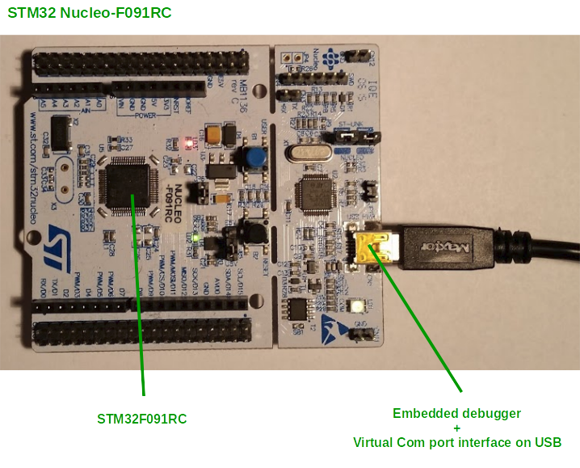

# hodea-stm32f0-project-template

## Introduction

This is template for projects using a STM32F0 MCU with the firmware split
into a bootloader and an application project. The template itself is
tested on a NUCLEO-F091RC, but it should be easy to adapt the template
for other controllers of the F0 series.

## Hardware

