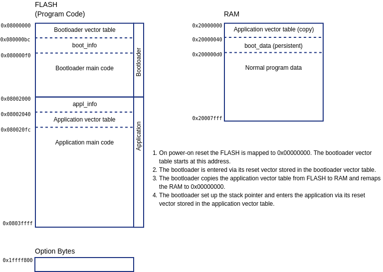
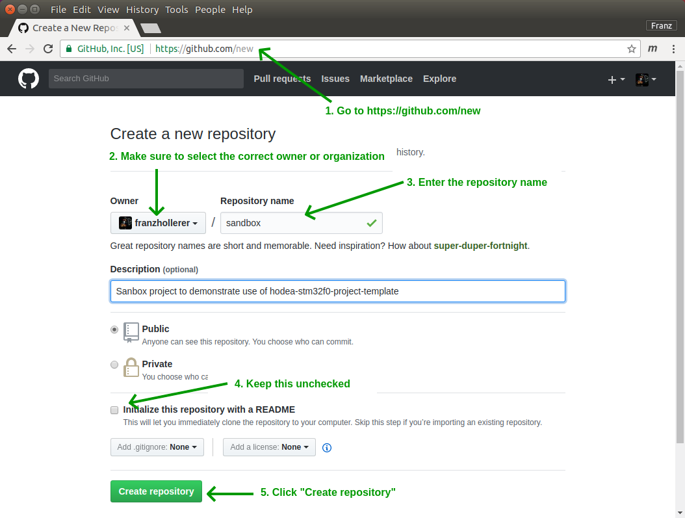
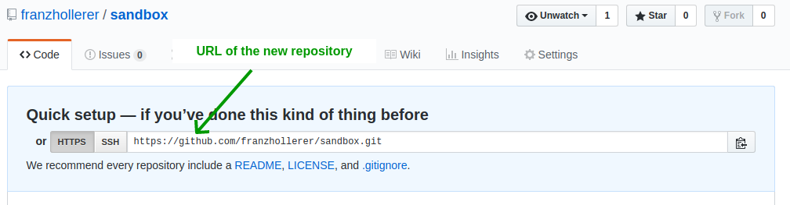
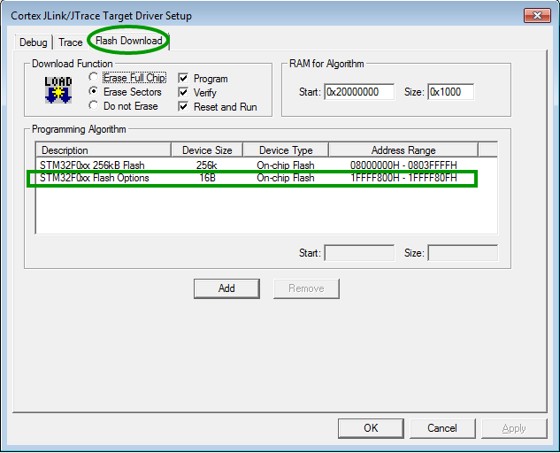
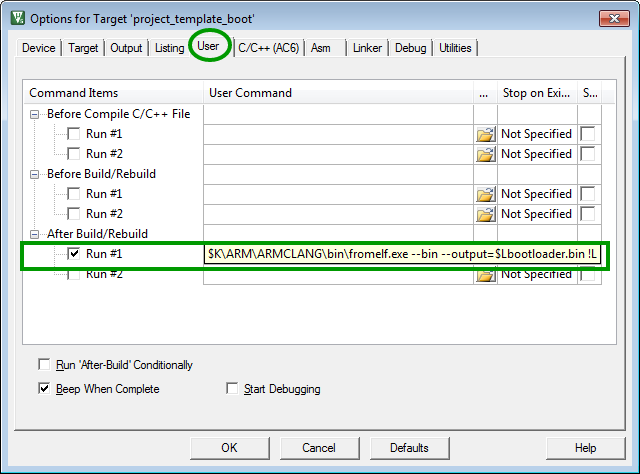
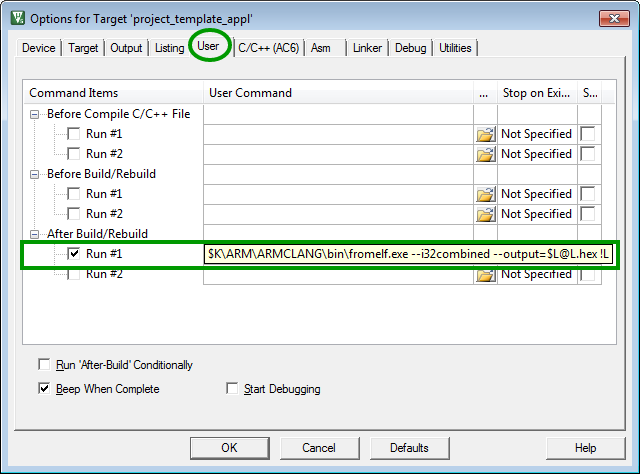
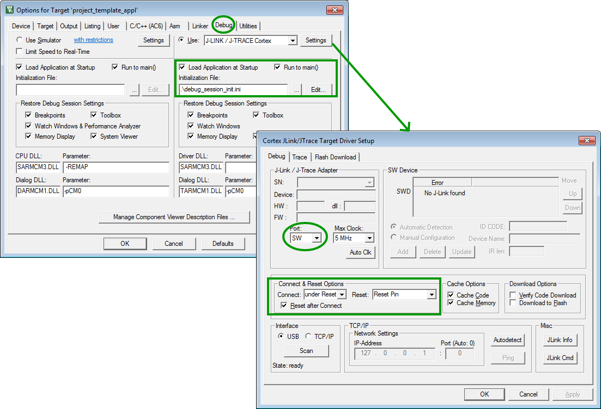

# hodea-stm32f0-project-template

## Introduction

This document describes the project template for STM32F0 MCUs. The purpose
is to describe how to split the firmware into a bootloader and application
project. It includes the
[HODEA source code library](https://github.com/hodea/hodea-lib) as git
submodule and provides project files for the
[GNU Arm Embedded Toolchain](https://github.com/hodea/hodea-lib/wiki/GNU-Arm-Embedded-Toolchain)
and 
[Keil MDK-ARM](https://github.com/hodea/hodea-lib/wiki/Keil-MDK-ARM).


## Hardware

The project template described here runs on a
[NUCLEO-F091RC](http://www.st.com/content/st_com/en/products/evaluation-tools/product-evaluation-tools/mcu-eval-tools/stm32-mcu-eval-tools/stm32-mcu-nucleo/nucleo-f091rc.html).
It is based on a STM32F091RC (256 kB FLASH, 32 kB SRAM, LQFP) and includes
an embedded ST-LINK/V2 debug tool.


The embedded debugger provides the debug probe, and in addition a virtual
COM port interface on USB. This virtual COM port is connected to USART2
of the target STM32 MCU which is used for printf() within this project
template.

### Note
We have converted the embedded ST-Link/V2 into a
[Segger J-Link](https://www.segger.com/products/debug-probes/j-link/models/other-j-links/st-link-on-board/#tab-3952-4)
in order to use the
[Segger Ozone J-Link debugger](https://www.segger.com/products/development-tools/ozone-j-link-debugger/#tab-16400-4).

## Project organization and implementation details

### Directory structure

The directory *boot* contains the source code of the bootloader,
*appl* of the application. The directory *share* contains source code files
used by both. There is an infrastructure to build bootloader and
application independent from each other.

```
hodea-stm34f0-project-template
├── appl                            Source code beloning to the application
│   ├── arm
│   │   └── ...
│   ├── gcc
│   │   └── ...
│   ├── hodea_user_config.hpp
│   ├── main.cpp
│   └── system_stm33f0xx.cpp
├── boot                            Source code beloinging to the bootloader
│   ├── arm
│   │   └── ...
│   ├── gcc
│   │   └── ...
│   ├── hodea_user_config.hpp
│   ├── main.cpp
│   ├── option_bytes.cpp
│   └── system_stm33f0xx.cpp
├── share                           Source code files shared between bootloader
│   ├── boot_appl_if.cpp            and application
│   ├── boot_appl_if.hpp
│   ├── digio_pins.hpp
│   └── hodea_user_config.hpp
├── hodea-lib                       Hodea library included as git submodule
│   └── ...
├── hodea-stm33f0-vpkg              CMSIS files included as git submodule
│   └── ...
├── Makefile                        Makefile and CMake files to build the
├── CMakeLists_appl.txt             project with gcc under Linux
├── CMakeLists_boot.txt
├── build                           Build directory for gcc. Can be deleted
│   ├── appl                        to remove temporary files.
│   │   └── ...
│   └── boot
│       ├── option_bytes.bin
│       ├── bootloader.bin
│       └── ...
└── MDK-ARM                         Keil MDK-ARM project files
    ├── project_template_appl.*
    ├── project_template_boot.*
    ├── project_template.uvmpw
    └── build                       Build directory for MDK-ARM. Can be deleted
        ├── appl                    to remove temporary files.
        │   └── ...
        └── boot
            ├── bootloader.bin
            │   ├── BOOT
            │   └── OPTION_BYTES
            └── ...
```

### Bootloader and appliction combined into a single .elf and .hex file

The build process of the bootloader generates binary images for the bootloader
firmware and the option bytes.

When the application is built this binaries are included to generate
the final .elf and .hex file.

Having the bootloader included into the application firmware image
eases development and debugging. Furthermore the factory normally requires
a single .hex file for production too.

Note: As the bootloader and option bytes are included as binary there is no
risk that it is subject to fancy compiler optimizations accross bootloader
and application.

### Memory map



### boot_info data structure

The *boot_info* is a data structure located in Flash memory preceeding the
bootloader main code. It gives some information about the bootloader. The
structure is declared in *share/boot_appl_if.hpp* and defined in
*boot/main.cpp*.

Declaration in share/boot_appl_if.hpp:

```cpp
/**
 * Information about the bootloader.
 */
typedef struct {
    uint16_t magic;     //!< Magic number used to check integrity.
    uint32_t version;   //!< Bootloader version information.
    char id_string[30]; //!< Textual information about the bootloader image.
} Boot_info;

static const Boot_info& boot_info =
    *reinterpret_cast<Boot_info*>(boot_info_addr);

```

Definition in boot/main.cpp:

```cpp
const Boot_info boot_info_rom 
    __attribute__((section(".boot_info"), used)) =
{
    boot_magic,                 // magic
    1,                          // version
    "project_template boot"     // id_string
};

```

*boot_info* contains a field *magic* which is compounded of a random number
and the size fo the *boot_info* structure. It can be used by the application
to ensure that it is really acccessing a *boot_info* structure. This is
defensive programming and helps to catch bugs in the linker script or
memory map beforehand.

### appl_info data structure

The *appl_info* is similar to *boot_info*. It provides some information
about the application. The structure is declared in *share/boot_appl_if.hpp*
and defined in *appl/main.cpp*.

Declaration in share/boot_appl_if.hpp:

```cpp
/**
 * Information about the application.
 */
typedef struct {
    uint16_t magic;      //!< Magic number used to check integrity.
    uint16_t ignore_crc; //!< Ignores CRC if set to \a ignore_appl_crc_key.

    /**
     * CRC-32 over application code.
     * The CRC is calculated from the version member of this structure
     * till appl_end_addr.
     *
     * (Ethernet) polynomial: 0x4C11DB7
     * CRC initial value: 0xffffffff
     */
    uint32_t crc;
    uint32_t version;   //!< Application version information.
    char id_string[30]; //!< Textual information about the bootloader image.
} Appl_info;

static const Appl_info& appl_info =
    *reinterpret_cast<Appl_info*>(appl_info_addr);
```

Definition in appl/main.cpp:

```cpp
const Appl_info appl_info_rom 
    __attribute__((section(".appl_info"), used)) =
{
    appl_magic,                 // magic
    ignore_appl_crc_key,        // ignore_crc
    0,                          // crc
    1,                          // version
    "project_template appl"     // id_string
};
```

At first look is seems inconsequent that *boot_info* is located after the
bootloader vector table, while *appl_info* is located before the application
vector table. This has technical reasons. After reset the MCU expects the
bootloader vector table at the begin of the Flash memory. The application
code is entered by the bootloader, which gives us some freedom about the
position of the application vector table. As we want the CRC over the
application code to cover the application main code and its vector table,
we decided to place *appl_info* before the application vector table.

### boot_data structure

The *boot_data* structure contains runtime data. It is used to pass information
from the application to the bootloader. It is located in RAM and must be
persistent as the application uses a software reset to invoke the
bootloader.

*boot_data* is declared in *share/boot_appl_if.hpp* and defined in
*share/boot_appl_if.cpp*.

Declaration in share/boot_appl_if.hpp:

```cpp
/**
 * Persistent data in SRAM shared between bootloader and application.
 */
typedef struct {
    /**
     * Set by the application to \a update_requested_key to instruct the
     * bootloader to start the firmware update.
     */
    uint16_t update_requested;

    /**
     * CRC over application code as calculated by the bootloader.
     *
     * This is provided for convenience. It may be read out via a debugger
     * at the point appl_info needs to be prepared for a new release.
     */
    uint32_t appl_crc;

    // additional data which needs to be persistent comes here...
} Boot_data;

extern Boot_data boot_data;

constexpr uint16_t update_requested_key = 0xd989;

```

Definition in share/boot_appl_if.cpp:

```cpp
Boot_data boot_data __attribute__((section(".boot_data"), used));
```

## Create a new project based on this project template

The following steps are required to create a new project based on this
template:

1. Chose a name for your new project repository
2. Create an empty git repository
3. Duplicate the project template to your new repository
    - Make a *bare clone* of the project template repository to your local
      working directory
    - Mirror the *bare clone* to the empty repository created in step 2
    - Remove the *bare clone* from your working directory
    - *Clone* the new repository to your local working directory
4. Checkout the required submodules
5. Rename and edit project files
6. Commit changes to the server

### Step 1: Chose a name for your new project repository

The new repository used for the following description is named: sandbox.

### Step 2: Create an empty git repository

We assume that your are using github. To create a new git repository go to
to [https://github.com/new](https://github.com/new) and follow the steps
below:



The subsequent page gives the URL for the new repository:



### Step 3: Duplicate the project template to your new repository

Execute the following commands in the Git Bash command line to duplicate
the project template into the new project repository:

```shell
# Make a bare clone of the project template repository
$ git clone --bare https://github.com/hodea/hodea-stm32f0-project-template.git sandbox.tmp

# Mirror-push to the new repository
$ cd sandbox.tmp
$ git push --mirror https://github.com/franzhollerer/sandbox.git

# Remove the bare clone from the working directory
$ cd ..
$ rm -rf sandbox.tmp

# Clone the new repository
$ git clone https://github.com/franzhollerer/sandbox.git
$ cd sandbox
```

### Step 4: Checkout the required submodules

Execute the following command to check out the required submodules.

```shell
$ git submodule update --init
```
### Step 5a: Rename and edit project files - for GCC users

First of all remove the directory *figures* and rewrite *README.md*. You may
also want to adjust *LICENSE*.

If you are using the GNU Arm Embedded Toolchain you can remove the following
directories and its content:

- MKD-ARM
- boot/arm
- appl/arm

The build process uses *cmake*. *CMakeList_boot.txt* is used to build the
bootloader, *CMakeList_appl.txt* the application. *Makefile* is a top-level
makefile which invokes cmake for the bootloader and the application.

You have to edit *CMakeList_boot.txt* and *CMakeList_appl.txt* and change
the variable TARGET_NAME to match your project.

### Step 5b: Rename and edit project files - for Keil MDK-ARM users

First of all remove the directory *figures* and rewrite *README.md*. You may
also want to adjust *LICENSE*.

If you are using Keil MDK-ARM you can remove the following files and
directories:

- Makefile
- CMakeList_boot.txt
- CMakeList_appl.txt
- boot/gcc
- appl/gcc

Rename all *project_template&ast;.&ast;* files in the MDK-ARM directory to
match the new project name, e.g. sandbox.

Now you have to edit the *&ast;.uvmpw* and *&ast;.uvprojx* files and replace
all occurrences of *project_template* with your new project name.
The files are XML files. You can use your preferred text editor for this
purpose.

### Step 6: Commit changes to the server

Finally, you have to commit the changes to the repository on the github
server:

```shell
$ git commit -a -m "project files renamed and edited"
$ git push
```

## Notes for Keil MDK-ARM toolchain

### Compiler toochain: armcc v6.x

Keil MDK-ARM is shipped with two compiler toolchains: armcc v5.x and
armcc 6.x. The newer toolchain is based on LLVM clang.

Hodea and this project template required armcc v6.x.


### Option bytes

The option bytes are located in a separate memory area and need a special
Flash programming algorithm.



### Bootloader and option bytes binary

Within the bootloader project the fromelf command line tool is used to
extract the bootloader and option byte binary from the ELF file.



### Single .hex file

Within the application project the fromelf command line tool is used to
generate a single .hex file, containing the bootloader, the application and
the option bytes.



### Debugger settings

The figure below shows he recommended settings for the debugger.


